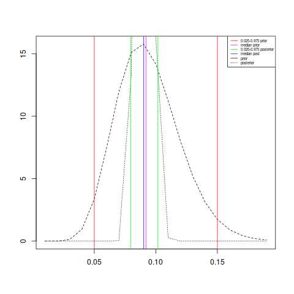
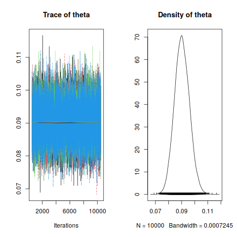
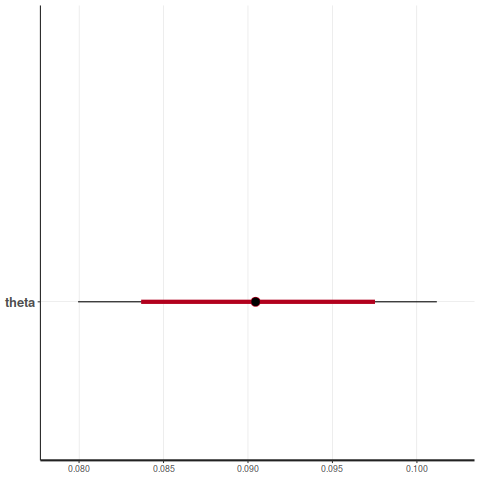
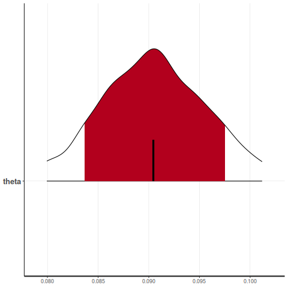

# Probability of a Defective: Binomial Data
    
## Overture

- St. Paul Brass and Aluminum Foundry makes a part called a ``push rod eye''.
- Out of $2430$ push rod eyes poured over seven days only $2211$ were actually
  shipped.
- It is of interest to estimate the probability of pouring a defective part.
- The President of Operations thinks that for this particular part a 
   plausible range for the proportion of scrap is $5\%$ to $15\%$
- We assume that the production process determines a proportion of defective
   parts that we call $\theta$.
- We treat the available data as random sample from the production process, and we 
     assume that all $2430$ parts are independent.
    
## Binomial Data

``` r 
library(knitr)
```

``` r
N <- 2430
n <- 2211
```

$$
y|\theta \sim Bin(`r N `,\theta)
$$

The distributions are called beta distributions, so we write

``` r 
fbeta <- function(x){
    return(qbeta(c(0.025,0.975),x[1],x[2]) - c(0.05,0.15))

library(rootSolve)
sol <- multiroot(fbeta,c(10,10))

aprior <- round(sol$root[1],2)
bprior <- round(sol$root[2],2)

round(qbeta(c(0.025,0.975),aprior,bprior),3)
```
$$  
\theta \sim Beta(`r aprior `, `r bprior `)
$$

``` r 
y <- N - n
apost <- y + aprior
apost
bpost <- N - y + bprior
bpost
##median posterior
median.post <- qbeta(0.5,apost,bpost)
##probability interval
post.int <- qbeta(c(0.025,0.975),apost,bpost)
``` 

With y = `r y `, computer simulations give the estimated median of the posterior distribution as $\tilde{\theta}$ = `r round(median.post,3) `.
There is a $95\%$ probability that $\theta$ falls within $(`r round(post.int[1],3) `,`r round(post.int[2],3) `)$.

## Exact Computations


$$
  p(\theta|D_n) = \frac{1}{ B(y + \alpha, N - y + \beta)}\theta^{(y + \alpha)}(1 - \theta)^{(N - y + \beta)}\\
$$

Posterior distribution $\theta | D_n$
    
$$
  \theta | D_n \sim \mathcal{B}(y + \alpha, N - y + \beta)\\
$$

    
``` r 
##median prior
qbeta(0.5,aprior,bprior)

##probability interval
qbeta(c(0.025,0.975),aprior,bprior)
```
$$
\alpha_{\text{post}} = y + \alpha \\
\beta_{\text{post}} = N - y + \beta \\
$$

``` r 
y <- N - n
y

th <- seq(0.01,0.99,by=0.01)

apost <- y + aprior
apost
bpost <- N - y + bprior
bpost

## theta | y ~ Beta(231.05,2327.06)

bposterior <- dbeta(th,apost,bpost)

##plot(bposterior ~ th,lty=3)
##abline(v=qbeta(c(0.025,0.975),apost,bpost),col="green")

##median posterior
qbeta(0.5,apost,bpost)
##probability interval
qbeta(c(0.025,0.975),apost,bpost)
```

## Bayes Estimators

``` r
meanpost <- apost/(apost + bpost)
meanpost
varpost <- (apost*bpost)/( (apost + bpost + 1)*(apost + bpost)^2 )
varpost
sqrt(varpost)
```


``` r 
th <- seq(0.01,0.19,by=0.01)
aprior <- 12.05
bprior <- 116.06
bp <- dbeta(th,aprior,bprior)
bp2 <- dbeta(th,apost,bpost)
```

```r 
plot(bp ~ th,type="l",lty=2,xlab="",ylab="")
abline(v=qbeta(c(0.025,0.975),aprior,bprior),col="red")
abline(v=qbeta(0.5,aprior,bprior),col="magenta")
lines(bp2 ~ th,lty=3)
abline(v=qbeta(c(0.025,0.975),apost,bpost),col="green")
abline(v=qbeta(0.5,apost,bpost),col="blue")
legend("topright",legend=c("0.025-0.975 prior","median prior", "0.025-0.975 posterior","median post","prior","posterior"),col=c("red","magenta","green","blue","black","black"),lty=c(1,1,1,1,1,3,2),cex=0.5)
```



## Simulated Values. rjags

``` r
library(rjags)
library(coda)
```

````{verbatim}
model
{
     ##likelihood
     y ~ dbin(theta,N)
     ##prior
     theta ~ dbeta(aprior, bprior)
}
````

``` r
dat <- list("N"=N,"y" = y,"aprior"=aprior,"bprior"=bprior)
dat.rod <- dat
```

``` r
jags.m <- jags.model(file="rodeyes.txt",data=dat,n.chains=4,n.adapt=500)
params <- c("theta")
samps <- coda.samples(jags.m,params,n.iter=10000)
```

``` r
summary(samps)
```

``` r
plot(samps)
```



## Simulated values. rstan


```r 
library(rstan)
```

````{verbatim}
data{
int<lower=0> N;
int<lower=0> y;
real<lower=0> aprior;
real<lower=0> bprior;
}
parameters{
real<lower=0,upper=1> theta;
}
model{
y ~ binomial(N,theta);
theta ~ beta(aprior, bprior);
}
````

```r 
rod.stan <- stan(file="rodeyes.stan",data=dat.rod,chains=4,iter=1000)
```

```r
print(rod.stan)
```

```r 
plot(rod.stan)
```


```r 
plot(rod.stan,show_density=TRUE)
```


